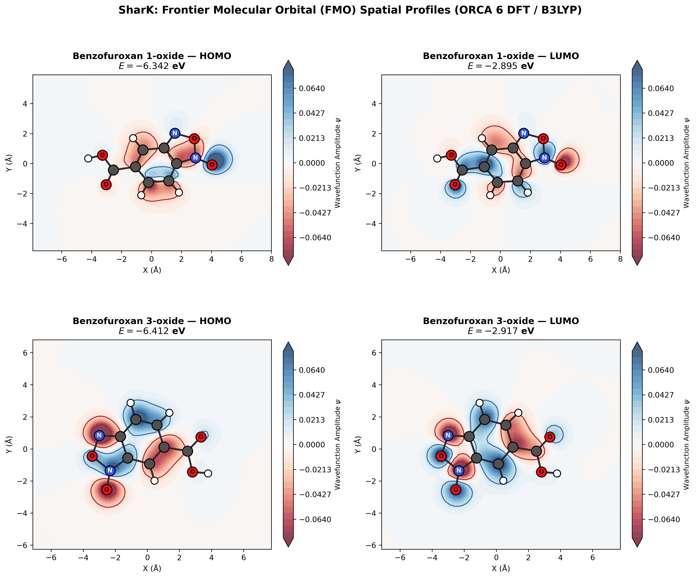

<p align="center">
  
</p>

<h1 align="center">SharK</h1>

<p align="center">
  <strong>Democratizing Computational Chemistry — Science Without Barriers</strong>
</p>

<p align="center">
  <a href="#overview">Overview</a> •
  <a href="#key-features">Key Features</a> •
  <a href="#quickstart">Quickstart</a> •
  <a href="#pilot-benchmark">Pilot Benchmark</a> •
  <a href="#license">Philosophy</a>
</p>

---

## Overview

**SharK** is an open-source, reproducible Python orchestrator and analysis engine for quantum chemistry, designed as an accessible alternative to proprietary workflows like WEASEL. 

SharK bridges high-throughput virtual screening (such as [**PoliScreen**](https://github.com/DiegoAnyG)) with rigorous quantum mechanics (DFT via ORCA 6.x). It automates the extraction of electronic structures, thermochemical equilibria, simulated infrared (FTIR) spectra, and frontier orbital visualizations into publication-grade reports.

---

## Key Features

- 🔬 **Robust ORCA 6 Parser**: Instant extraction of electronic energies ($E_{el}$), thermochemical corrections ($ZPE$, $H$, $G$, $S$), dipole moments, and vibrational modes from `.property.txt` and `.out` files.
- ⚖️ **Boltzmann Thermodynamics**: Calculates relative free energies ($\Delta G, \Delta H, \Delta E$) and equilibrium Boltzmann population distributions ($P_i$) at physiological or custom temperatures.
- 📈 **FTIR Transmittance Simulator**: Convolutes harmonic transitions with Lorentzian line-shapes into standardized FTIR transmittance spectra ($\%T$, 100% baseline, downward absorption dips) with shaded functional-group zones.
- 🌌 **Frontier Molecular Orbitals (FMO)**: Direct Gaussian `.cube` parsing to generate publication-quality 4-panel HOMO and LUMO phase-colored contour maps and total electron density ($\rho$) envelopes.
- 📑 **Zero-Dependency Reporting**: One-command generation of 300-DPI publication figures, GitHub-flavored Markdown summaries, and interactive standalone HTML dossiers.

---

## Quickstart

### Installation

Clone the repository and install in editable mode:

```bash
git clone https://github.com/DiegoAnyG/SharK.git
cd SharK
pip install -e .
```

### Python API

```python
from shark.core.parser import parse_orca_results
from shark.analysis.thermo import calculate_relative_thermo
from shark.reports.visualizer import plot_boltzmann_equilibrium, plot_ir_comparison

# 1. Parse ORCA calculation results
res1 = parse_orca_results("dft_benzofuroxan/tautomer_1_oxide", name="1-oxide")
res3 = parse_orca_results("dft_benzofuroxan/tautomer_3_oxide", name="3-oxide")

# 2. Compute relative thermochemistry and Boltzmann populations
df = calculate_relative_thermo([res1, res3], temperature=298.15)
print(df[["Name", "dG (kcal/mol)", "Population (%)"]])

# 3. Generate publication-ready figures
plot_boltzmann_equilibrium(df, "boltzmann_distribution.png")
plot_ir_comparison([res1, res3], "ir_spectra.png", mode="transmittance")
```

Run tests to verify installation:

```bash
pytest -v
```

---

## Pilot Benchmark: Benzofuroxan Tautomerism

SharK was benchmarked against the tautomeric equilibrium of benzofuroxan-5-carboxylic acid (B3LYP/def2-SVP/D4/CPCM Water):

| Species | Converged | $N_{imag}$ | $\Delta G$ (kcal/mol) | Boltzmann Pop (%) | Dipole (D) | HOMO-LUMO Gap |
|---|:---:|:---:|:---:|:---:|:---:|:---:|
| **Benzofuroxan 3-oxide** | Yes | 0 | **0.000** | **78.15%** | 3.60 D | 3.49 eV |
| **Benzofuroxan 1-oxide** | Yes | 0 | **+0.755** | **21.85%** | 4.25 D | 3.45 eV |

The 3-oxide is thermodynamically favored in solution, validating the conformer selected for docking studies.

<p align="center">
  
</p>

---

## Philosophy

Scientific progress should not be locked behind financial paywalls or proprietary software suites. **SharK** is developed under the premise that rigorous computational chemistry and biophysical discovery tools should be freely accessible to researchers, students, and institutions worldwide.
